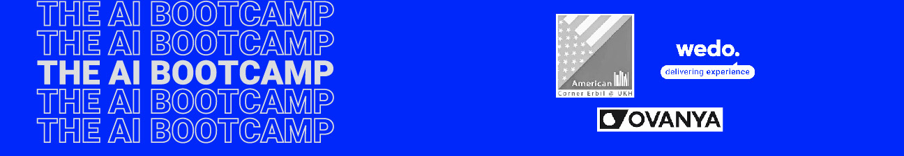

# 4-Week AI Bootcamp Curriculum
**Duration:** 12 sessions × 2 hours = 24 total hours  
**Schedule:** Three days in a week (Sunday, Tuesday, Thursday)

## Week 1: Foundations

### Session 1: Introduction
- Introduction to this AI bootcamp
- Overview of AI, Machine Learning, and Deep Learning
- Types of Machine Learning (Supervised, Unsupervised, Reinforcement)
- Key terminology and concepts
- Python environment setup
- Practical: Basic Python for Data Science review

### Session 2: Data Manipulation Basics
- NumPy fundamentals
- Pandas for data manipulation
- Loading different types of data (image, text)
- Data cleaning and preprocessing
- Exploratory Data Analysis (EDA)
- Practical: Data cleaning and visualization project

### Session 3: Machine Learning Basics
- ML workflow overview
- Linear Regression from scratch
- Scikit-learn introduction
- Train-test splits
- Model evaluation metrics
- Practical: First ML model from scratch (Linear Regression)

## Week 2: Core ML Algorithms

### Session 4: Supervised Learning for Classification
- Logistic Regression
- Decision Trees
- Random Forests
- Practical: Binary classification project

### Session 5: Supervised Learning - Advanced
- Support Vector Machines
- K-Nearest Neighbors
- Cross-validation
- Hyperparameter tuning
- K-means clustering (Unsupervised Learning)

### Session 6: Project Management
- Project Management by Wedo

## Week 3: Deep Learning

### Session 7: Neural Networks Fundamentals
- Artificial Neural Networks basics
- Forward and backward propagation
- Activation functions
- Loss functions and optimizers
- Practical: Building a simple neural network with PyTorch

### Session 8: Deep Learning in Practice
- CNN architecture
- Transfer Learning
- Data augmentation
- GPU training
- Practical: Image classification project

### Session 9: Transformer Architectur
- Attention is all you need paper
- Position embedding
- Attention mechanism
- Transformer architecture

### Session 10: Encoder-Decoder Models
- Tokenizers
- Word embedding
- Warmstart Encoder-Decoder Models

## Week 4: AI in Production

### Session 12: Language Models
- Bert 
- GPT
- Train Bert like language model

### Session 12: Docker & Deployment
- Model serialization
- REST APIs with FastAPI
- Basic software engineering practices
- Containerizing ML applications with Docker
- Development vs production environments
- Practical: Creating a REST API and Dockerizing the ML application

### Session 13: Machine Translation Final Project
- End-to-end ML project
- Model development to deployment
- Best practices and optimization
- Project presentations
- Next steps and resources
- Final words

## Prerequisites
- Basic Python programming
- Understanding of basic statistics
- GitHub account

## Required Software
- Python 3.8+
- Anaconda
- VS Code
- Docker Desktop
- Git

## Learning Resources
- Course materials (Jupyter notebooks)
- Practice datasets
- Reference code samples
- Recommended readings for each session
